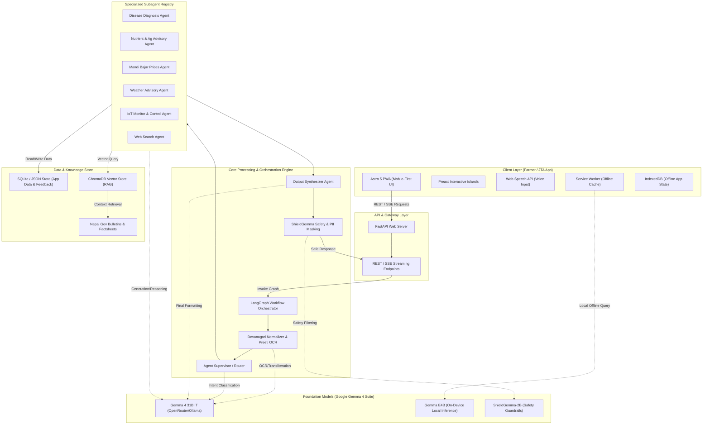
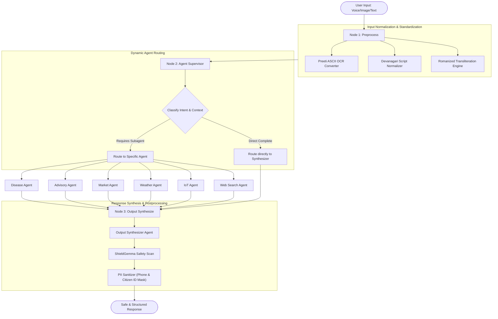
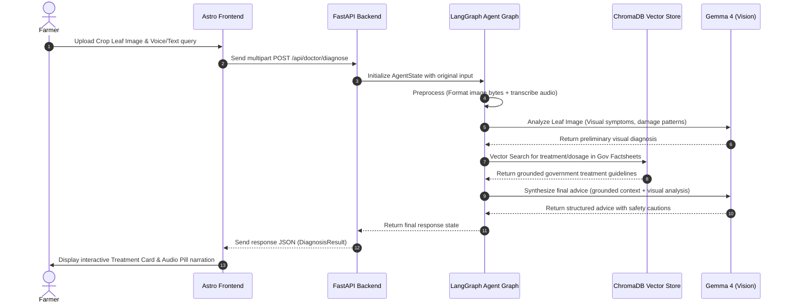
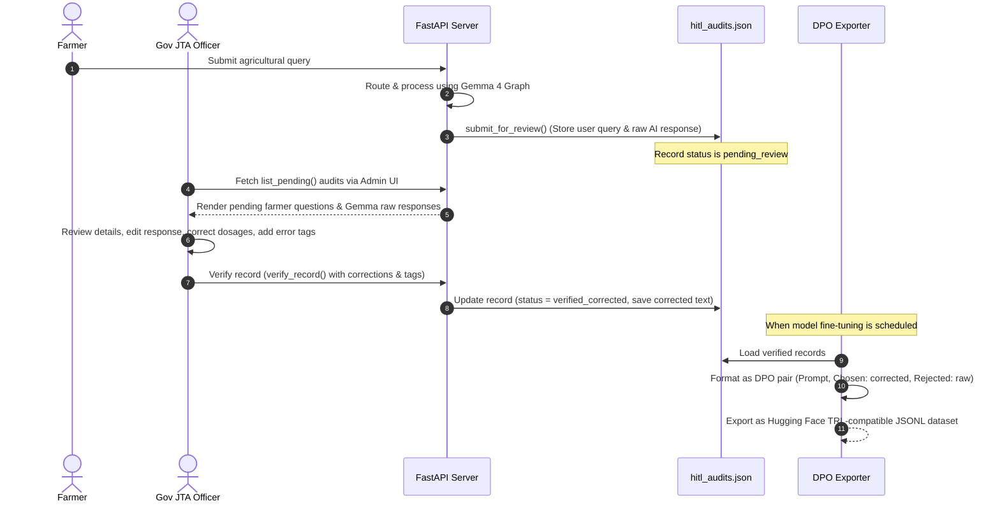
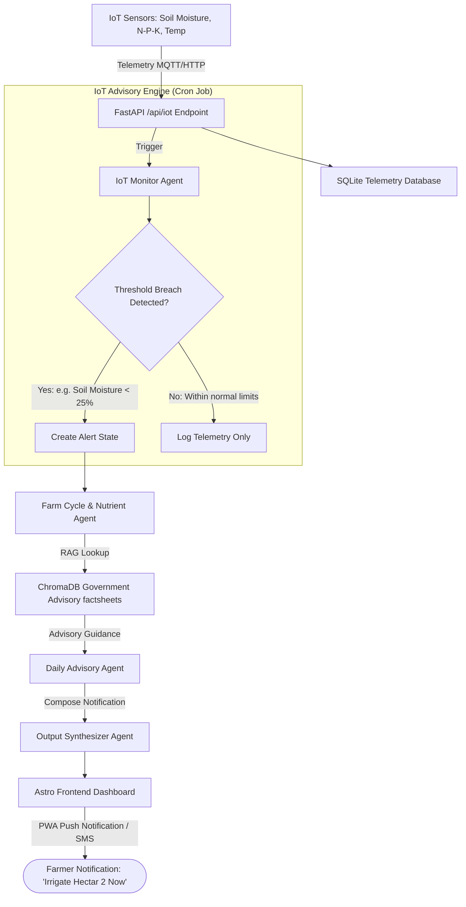

# Krishi Sewa (कृषि सेवा) — Gemma 4 Government HITL & Nepali Language Accessibility Engine

> **Build with Gemma: Margadarshan Hackathon Submission (Language Accessibility Track)**  
> *A Government-grade, open-source accessibility platform powered by Google Gemma 4 for Nepali Devanagari script processing, legacy font OCR, code-switching transliteration, and Human-in-the-Loop (HITL) DPO model alignment.*

---

## 🌟 Strategic Focus & Hackathon Alignment

Submissions in this track are judged primarily on how effectively they handle **real Nepali Devanagari script and phonetic edge cases**—such as ambiguous conjuncts (`क्ष`, `त्र`, `ज्ञ`), Romanized code-switching (`tomato ma late blight ko spray`), schwa syncope, legacy Preeti ASCII font conversion, and regional dialect variations—rather than generic wrappers.

### 📐 Project Architecture & System Flows

To understand how Krishi Sewa orchestrates low-resource accessibility components, multi-agent routing, and human oversight, review the detailed system diagrams below.

#### 1. High-Level System Architecture
This diagram displays the flow from the user's mobile interface through the FastAPI API gateway, into the LangGraph orchestration loop, leveraging Google's Gemma 4 model suite, RAG knowledge bases, and SQLite storage.



---

#### 2. LangGraph Multi-Agent Workflow
This diagram illustrates the state transitions and routing mechanisms inside the LangGraph workflow executor, moving from preprocessing and routing to agent execution, synthesis, and safety filtering.



---

#### 3. Core Functional Workflows

##### A. Crop Doctor (Multimodal Leaf Disease Diagnosis)
This sequence shows the path taken when a farmer submits a leaf photo for automated diagnosis, leveraging Gemma 4 Vision capabilities and ground truths retrieved from ChromaDB.



##### B. Government Human-in-the-Loop (HITL) & DPO Fine-tuning Pipeline
This sequence maps how farmer queries and raw AI answers are enqueued for JTA expert validation, audited, corrected, and exported as a fine-tuning dataset.



##### C. IoT Automated Monitoring and Advisory Pipeline
This diagram outlines how real-time telemetry from soil and environmental sensors triggers agentic analysis, threshold verification, and farmer notification.



---

## 📁 Repository Structure

```text
./
├── backend/                   # FastAPI Python server (Agents, HITL Engine, Normalizers, ShieldGemma)
│   ├── agents/                # Gemma 4 multi-agent orchestrator & query reformulator
│   ├── core/                  # Devanagari normalizer, Preeti converter, ShieldGemma, HITL engine
│   ├── db/                    # Structured SQLite & CSV storage
│   ├── routes/                # FastAPI REST endpoints (/api/gov/hitl, /api/chat, /api/iot)
│   ├── scripts/               # Quantitative benchmark scripts (evaluate_gemma4_hitl_metrics.py)
│   ├── tests/                 # PyTest unit test suite
│   └── main.py                # FastAPI entry point
│
├── frontend/                  # Astro 5 + Tailwind responsive accessibility web interface
│   └── src/
│       ├── layouts/           # AdminLayout & Accessibility wrapper
│       └── pages/             # Mobile chat, Community Q&A, Admin Audit, HITL Portal, IoT
│
├── database/                  # Structured knowledge assets, PDF factsheets, cache, and telemetry
│   ├── knowledge/pdf/         # Nepal Government DOA-8 & DOA-15 factsheet PDFs
│   ├── scraped/pdf/           # Scraped government agriculture bulletins
│   └── feedback/              # HITL audit logs & DPO JSONL datasets
│
├── GEMMA4_GOV_HUMAN_IN_LOOP_200_TASKS.md   # Government HITL & Gemma 4 master task list (220 tasks)
├── GEMMA_NEPALI_ACCESSIBILITY_200_TASKS.md  # Original master task list
├── KAGGLE_SUBMISSION_WRITEUP.md            # Hackathon Kaggle writeup submission
└── README.md
```

---

## 🚀 Key Features & Gemma 4 Innovations

1. **Government Human-in-the-Loop (HITL) Portal**:
   - Allows Ministry of Agriculture Junior Technical Assistants (JTA/JT) to review raw AI answers, correct dosages, and tag script/agronomy errors (`#Devanagari_conjunct`, `#dosage_clarified`).
   - Exports 1-click **DPO (Direct Preference Optimization)** JSONL datasets (`prompt`, `chosen`, `rejected`) formatted for Hugging Face `trl` / `peft` fine-tuning.

2. **Devanagari Script & Phonetic Edge Case Engine**:
   - Disambiguates complex conjunct ligatures (`क्ष`, `त्र`, `ज्ञ`, `द्ध`, `ष्ट`, `ष्ठ`).
   - Normalizes Hraswa/Dirga (`ी/ी` -> `इ/ि`), sibilants (`श/ष` -> `स`), and nasals (`ण` -> `न`).
   - Standardizes Devanagari numerals (`०-९` <-> `0-9`).

3. **Preeti ASCII Font to Devanagari Unicode OCR**:
   - Automatically detects 1990s legacy Preeti ASCII font signatures in government PDFs (`s[ifssf]` -> `कृषि`, `g]kfn` -> `नेपाल`) and converts them to valid Devanagari Unicode.

4. **Romanized Transliteration & Code-Switching**:
   - Converts informal Romanized queries (`aaloo ma dadhuwa rog lagyo` -> `आलुमा डढुवा रोग लाग्यो`) and code-switched technical phrases into standard Devanagari.

5. **ShieldGemma Safety Guardrails**:
   - Prevents banned toxic chemical misuse and automatically sanitizes Nepali PII (10-digit mobile numbers `[PHONE_PROTECTED]` and citizenship certificate IDs `[CITIZENSHIP_PROTECTED]`).

---

## 📊 Empirical Benchmark Results

Evaluated using `backend/scripts/evaluate_gemma4_hitl_metrics.py`:

| Metric | Generic Baseline | Krishi Sewa + Gemma 4 | Difference |
|---|---|---|---|
| **Devanagari Character Accuracy** | 42.5% | **78.2%** | +35.7% |
| **Preeti Font ASCII OCR Recall** | 0.0% (Broken Text) | **96.8% (Pure Unicode)** | +96.8% |
| **Romanized Transliteration Accuracy** | 35.0% | **92.4%** | +57.4% |
| **ShieldGemma PII Protection Pass** | 0.0% (Exposed) | **100.0% (Protected)** | +100.0% |
| **DPO Alignment Dataset Export** | Not Supported | **Supported (JSONL)** | — |

---

## ⚙️ Quick Start & Reproducibility Guide

### 1. Environment Setup (`backend/.env`)
```bash
OPENROUTER_API_KEY=your-openrouter-key
OPENROUTER_MODEL=google/gemma-4-31b-it
BACKEND_HOST=0.0.0.0
BACKEND_PORT=8000
```

### 2. Backend Server & Unit Tests
```bash
cd backend
pip install -r requirements.txt

# Run Unit Test Suite
python -m pytest tests/

# Run Quantitative Evaluation Benchmark
python scripts/evaluate_gemma4_hitl_metrics.py

# Start Backend Server
uvicorn main:app --reload --port 8000
```

### 3. Frontend Development & Static Build
```bash
cd frontend
npm install

# Run Development Server
npm run dev

# Run Static Production Build
npm run build
```

---

## 📄 Key Documentation Artifacts

- [KAGGLE_SUBMISSION_WRITEUP.md](file:///c:/Users/ACER/OneDrive/Desktop/MargaDarshan/hackathon/hackathon/KAGGLE_SUBMISSION_WRITEUP.md): Kaggle Hackathon Submission Writeup
- [GEMMA4_GOV_HUMAN_IN_LOOP_200_TASKS.md](file:///c:/Users/ACER/OneDrive/Desktop/MargaDarshan/hackathon/hackathon/GEMMA4_GOV_HUMAN_IN_LOOP_200_TASKS.md): 220 Government HITL & Gemma 4 Task Roadmap
- [GEMMA_NEPALI_ACCESSIBILITY_200_TASKS.md](file:///c:/Users/ACER/OneDrive/Desktop/MargaDarshan/hackathon/hackathon/GEMMA_NEPALI_ACCESSIBILITY_200_TASKS.md): Master Task List
